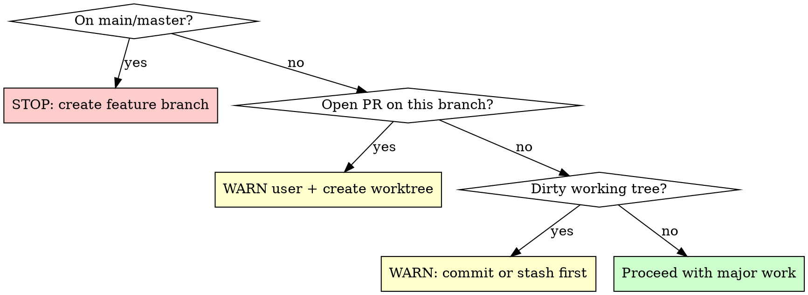

# Major Work Pre-flight

## Overview

Before starting major work, run a pre-flight checklist to avoid polluting branches with outstanding PRs or losing uncommitted work.

**Core principle:** Major work deserves a clean workspace. Check before you build.

## When to Use

**Trigger heuristics — is this "major"?**

- **Destructive refactors:** Deleting/rewriting modules, changing DB schema, consolidating multiple files
- **Multi-session scope:** User says "this will take a few sessions", or scope clearly exceeds one sitting
- **Experimental/exploratory:** Spiking, prototyping, "let's try X and see"

When NOT to use: single-file edits, bugfixes, adding a test, small features that fit in one commit.

## Pre-flight Checklist

Run these checks **in order** before writing any code:



### Step 1: Detect branch

```bash
git rev-parse --abbrev-ref HEAD
```

If `main` or `master`: **STOP.** Tell the user major work must happen on a feature branch. Do not proceed.

### Step 2: Check for open PRs

```bash
gh pr list --head <current-branch> --state open --json number,title,url
```

If any PR is open: **WARN the user explicitly:**

> "Branch `X` has open PR #N. Major work here will pollute the PR, force re-review, and risk merge conflicts. I recommend creating a worktree for this work."

Then create a worktree automatically (use `superpowers:using-git-worktrees` if available, otherwise `git worktree add`). The user can override, but the default is isolation.

### Step 3: Check dirty state

```bash
git status --short
```

If there are uncommitted changes: **WARN the user** and recommend committing or stashing before starting major work. Uncommitted changes + major refactor = recipe for lost work.

### Step 4: Proceed

All checks passed. Continue with normal workflow (planning, TDD, etc.).

## Common Mistakes

| Mistake | Fix |
|---------|-----|
| Skipping PR check because "it's almost merged" | Almost merged != merged. Check anyway. |
| Starting major work then discovering the PR later | Always run pre-flight BEFORE writing code. |
| Assuming dirty state is fine because "it's related" | Commit it. If it's related, it deserves its own commit. |

## Red Flags — STOP and Run Pre-flight

- User says "big refactor", "rewrite", "consolidate", "multi-session"
- You're about to delete or rewrite more than 2 files
- The work involves schema changes
- You're uncertain whether the branch has an open PR
