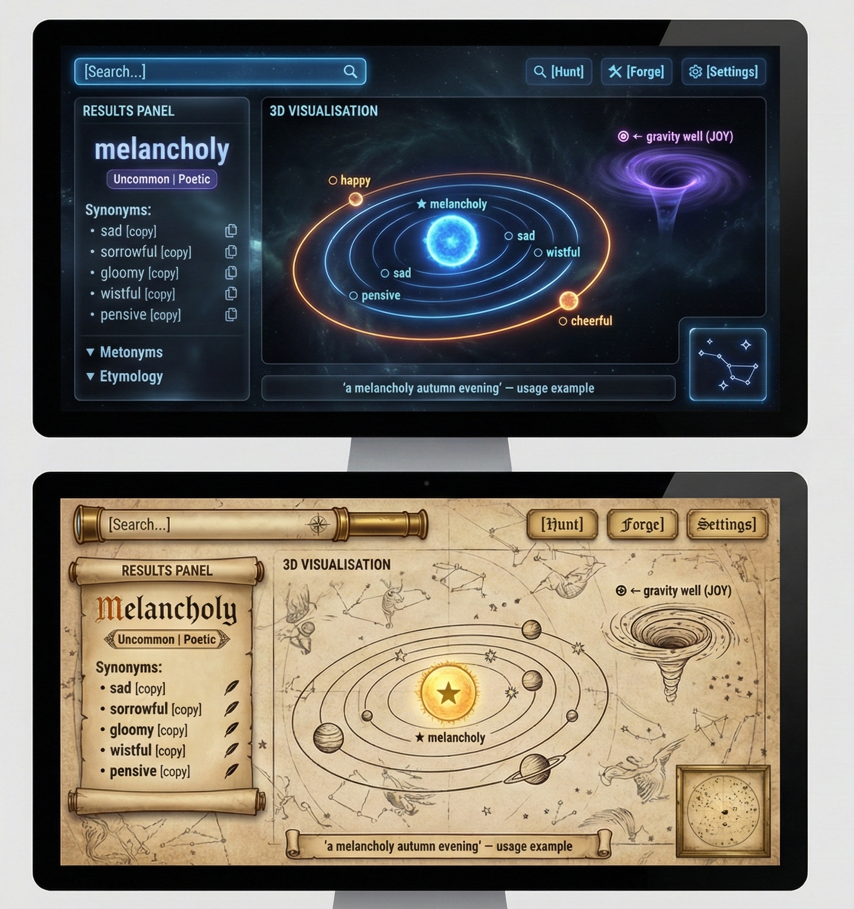

# Metaforge

A browser-based visual thesaurus and metaphor generator. Search a word and it blooms into a cluster of connected meanings — synonyms, antonyms, collocations, connotations, and usage examples. Click a neighbouring node and the whole graph reshuffles around it.

Bolted onto this is an experimental metaphor forge that surfaces surprising semantic bridges between words — part creative writing tool, part "let's see if this is even possible."



## Status

**Early MVP.** The API and basic graph navigation work. The metaphor forge is tuning its scoring pipeline. A staging deployment is live at [metaforge.julianit.me](https://metaforge.julianit.me/).

What exists today:

- Go API serving thesaurus lookups, graph traversal, and forge suggestions
- Lit + Three.js frontend with force-directed graph navigation
- Data pipeline enriching ~8,000 synsets with LLM-extracted semantic properties
- Concreteness regression (k-NN, r=0.91) filling gaps in psycholinguistic ratings
- Curated property vocabulary with 35k canonical entries from WordNet
- 3-stage property snapping cascade (exact, morphological, cosine similarity)
- ~370 automated tests across Go, Python, and TypeScript

What's next: Metaphor Forge UI, 20k word enrichment, CI/CD pipeline, polish for public launch.

## Architecture

```
┌─────────────────────────────────────────────────┐
│  Browser (Lit + Vite + TypeScript + 3d-force-graph)  │
└──────────────────────┬──────────────────────────┘
                       │ HTTP/JSON
┌──────────────────────▼──────────────────────────┐
│  Go API  (stateless, self-hostable)             │
│  /lookup  /graph  /forge/suggest  /strings      │
└──────────────────────┬──────────────────────────┘
                       │ SQLite
┌──────────────────────▼──────────────────────────┐
│  lexicon_v2.db                                  │
│  WordNet synsets + frequencies + embeddings +    │
│  LLM-extracted properties + concreteness scores │
└─────────────────────────────────────────────────┘
        ▲
        │ enrich.sh (Claude API + FastText + scikit-learn)
┌───────┴─────────────────────────────────────────┐
│  Data Pipeline  (Python)                        │
│  Import → Enrich → Curate → Snap → Evaluate     │
└─────────────────────────────────────────────────┘
```

## Quick Start

### Prerequisites

- Go 1.22+
- Python 3.11+ with venv
- Node.js 20+
- SQLite 3

### Setup

```bash
# Clone
git clone https://github.com/snailuj/metaforge.git
cd metaforge

# Python venv (data pipeline)
python3 -m venv .venv && source .venv/bin/activate
pip install -r data-pipeline/requirements.txt

# Frontend
cd web && npm install && cd ..
```

### Run

```bash
# Start the API (needs a built database — see Data Pipeline below)
cd api && go run ./cmd/metaforge --db ../data-pipeline/output/lexicon_v2.db --port 8080

# Start the frontend (in a separate terminal)
cd web && npm run dev
```

### Test

```bash
# Go
cd api && go test ./...

# Python
source .venv/bin/activate && python -m pytest data-pipeline/scripts/ -v

# Frontend
cd web && npm test
```

## Data Pipeline

The pipeline builds `lexicon_v2.db` from raw linguistic sources (WordNet via sqlunet, Brysbaert familiarity/concreteness ratings, SUBTLEX-UK frequencies, SyntagNet collocations, VerbNet) and enriches it with LLM-extracted semantic properties.

See [`data-pipeline/CLAUDE.md`](data-pipeline/CLAUDE.md) for detailed operations, data sources, and CLI reference.

## Data Sources

| Source | What it provides |
|--------|-----------------|
| [OEWN](https://en-word.net/) (via sqlunet) | Synsets, lemmas, semantic relations |
| [Brysbaert et al.](https://link.springer.com/article/10.3758/s13428-013-0403-5) | Concreteness ratings for 37k English lemmas |
| GPT-4 Familiarity Estimates | Word familiarity ratings |
| SUBTLEX-UK | Subtitle word frequencies |
| SyntagNet | Collocation pairs |
| VerbNet | Verb classes, roles, examples |
| [FastText](https://fasttext.cc/) wiki-news-300d | Word embeddings for similarity and regression |

## Project Structure

```
api/                    Go API server
  cmd/metaforge/        Entry point
  internal/
    db/                 SQLite data layer
    handler/            HTTP handlers
    forge/              Forge scoring pipeline
    embeddings/         FastText embedding lookups
    thesaurus/          Core thesaurus logic
web/                    Lit + Vite frontend
  src/components/       Web components
  src/graph/            3d-force-graph wrapper
data-pipeline/
  scripts/              Python pipeline scripts
  output/               Generated data (enrichment JSON, evals)
  SCHEMA.sql            Canonical database DDL
  PRE_ENRICH.sql        Baseline DB dump (restore point)
docs/
  designs/              Feature design documents
  plans/                Implementation plans
```

## Contributing

This project is built by a small team and is open to contributions. If you're interested, open an issue or PR. The codebase follows TDD — write a failing test first, then the minimal code to pass it.

## Licence

Not yet formally decided. The intent is free and open-source, operated by a New Zealand Charitable Trust. See the [PRD](Metaforge-PRD-2.md#open-source-and-non-profit) for background on the project's non-commercial ethos.
